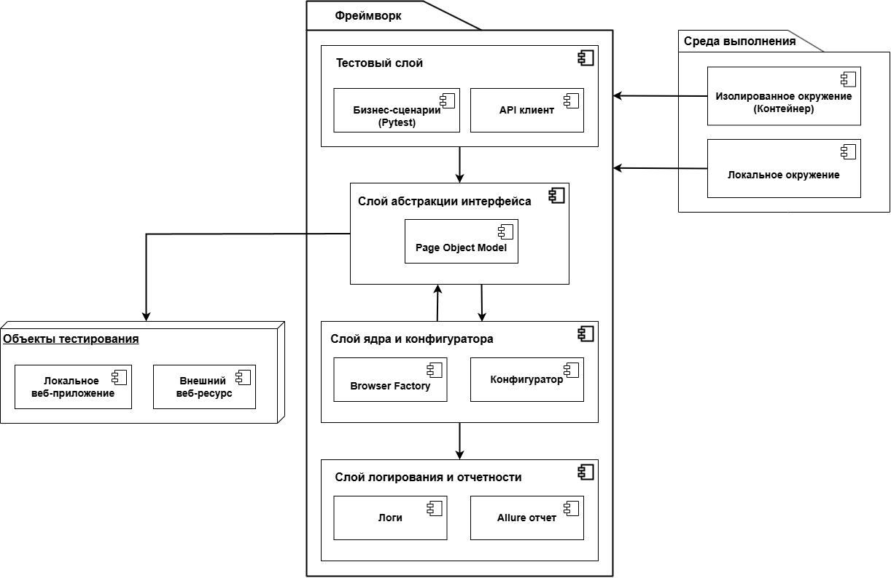
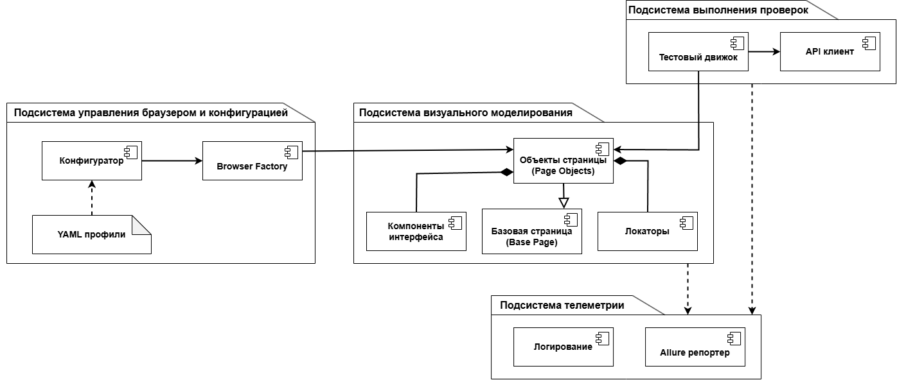
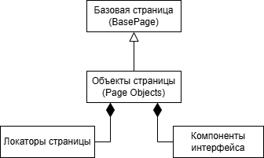
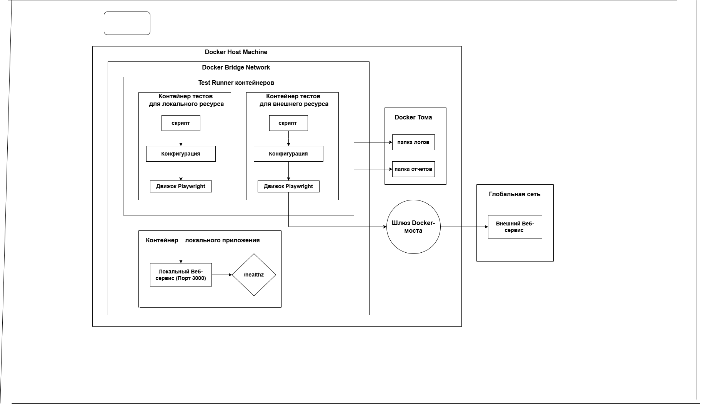
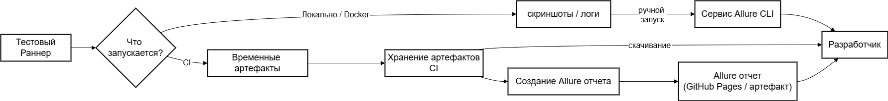

## End-to-End Testing Framework — Project Documentation

### Introduction

This project implements a framework for automated testing of web applications.

The main goal of the project is to develop a reusable environment that simplifies the creation, execution, and analysis of end-to-end tests.

The framework is built as a full-fledged software system. Its foundation is the separation of test logic, user interface components, configuration, execution infrastructure, and reporting.

The main tasks of the testing environment are:

- automated user interface testing
- automated API testing
- working with local and external web applications
- containerized execution environment
- configuration management using YAML profiles
- CI/CD integration
- test reporting and results analysis

The framework is implemented using Python and modern test automation tools.

---

## Technology Stack

- Python 3.12
- Pytest
- Playwright
- Docker / Docker Compose
- Allure Reports
- GitHub Actions (CI/CD)

Additional libraries:

- `requests`
- `pyyaml`

---

## Demo Application

The `demo-app` directory contains a lightweight web application used as the system under test.

It includes:

- HTML interface
- simple JavaScript logic
- a minimal backend server

This makes it possible to perform stable and reproducible UI and API tests.

---

## Architecture

The framework architecture is built as a multi-layered system in which the test layer, interface abstraction layer, core, and infrastructure are separated by responsibility.

  
*Figure 1. Multi-layer architecture of the framework*

### Main Architectural Elements

The system includes four logical layers:

1. **Test Layer**  
   This layer contains business scenarios written in Pytest.  
   It describes the logic of the checks rather than technical browser operations.

2. **Interface Abstraction Layer**  
   This layer contains the Page Object Model, UI components, and locators.  
   It serves as a bridge between the tests and the system under test.

3. **Core and Configuration Layer**  
   This layer includes BrowserFactory, ConfigReader, and supporting mechanisms for browser and settings management.  
   Configuration is defined through YAML profiles, which makes it possible to use different environments without changing the test source code.

4. **Logging and Reporting Layer**  
   This layer collects logs, screenshots, and testing artifacts, after which Allure reports are generated.

The architecture also explicitly includes the test targets:

- local web application
- external web resource

---

## Component Subsystem

After the overall architecture is described, the system is decomposed into functional subsystems.

  
*Figure 2. Component diagram*

### Main Subsystems

1. **Visual Modeling Subsystem**  
   Includes the Page Object Model, UI components, and locators.

2. **Browser Session and Configuration Management Subsystem**  
   Responsible for YAML profiles, ConfigReader, and BrowserFactory.

3. **Test Execution Subsystem**  
   Contains the test engine and API client, providing support for UI and API testing.

4. **Telemetry Subsystem**  
   Combines logging and the Allure reporter.

### Component Purpose

- **Page Objects** hide DOM details and represent pages as objects.
- **Locators** store selectors separately from test logic.
- **UI Components** allow reuse of frequently used interface elements.
- **ConfigReader** loads runtime parameters from YAML.
- **BrowserFactory** creates and configures the browser session.
- **API Client** handles HTTP requests and backend logic checks.
- **Logger** records the test execution flow.
- **Allure Reporter** generates a visual report of test runs.

---

## Page Object Model

The Page Object Model pattern is used for interacting with the user interface.

  
*Figure 3. Page Object Model architecture*

### How POM Is Organized

- **Locators** are placed in separate classes and stored centrally.
- **Base Page** contains common low-level browser actions.
- **Page classes** inherit from the base page and implement user scenarios.
- **UI Components** are used as separate reusable interface blocks.

### Benefits of This Approach

- reduces code duplication
- simplifies test maintenance
- makes scenarios more readable
- reduces dependency on DOM tree changes
- allows pages to be assembled from ready-made elements

---

## Browser and Configuration Management

The framework uses configuration as data.  
Runtime parameters are defined separately from the test code, which makes the system more flexible and easier to use in different environments.

### YAML Configuration

YAML profiles define:

- base URL
- browser type
- run mode
- window size
- global timeouts
- environment parameters

Example profiles:

- `demoapp.local.yaml`
- `demoapp.docker.yaml`
- `demoqa.local.yaml`

### Role of ConfigReader

`ConfigReader` loads the required profile, validates the parameters, and passes them further into the execution system.

### Role of BrowserFactory

`BrowserFactory` creates an isolated browser context based on the configuration.  
This makes it possible to run each test in a clean session without interference from previous runs.

---

## UI and API Testing Support

The framework is built as a hybrid solution and supports two types of checks:

### UI Tests

UI tests verify:

- page rendering correctness
- interface behavior
- form and control behavior
- browser-based user scenarios

### API Tests

API tests verify:

- backend responses
- data structure
- status codes
- correctness of backend business logic

---

## Logging and Reporting

During test execution, the framework collects artifacts that help analyze results and identify error causes.

### What Is Saved

- execution logs
- screenshots on test failure
- additional attachments
- Allure report data

---

## Test Execution

Tests are executed using Pytest.

Examples:

```bash
pytest -k api -s -m app_demoapp --config=demoapp.local.yaml
pytest -m app_demoapp --config=demoapp.local.yaml
```

---

## Docker Integration

The test environment supports running inside Docker containers.


*Figure 4. Containerized infrastructure diagram*

What the Diagram Shows

- Test Runner executes tests inside a container
- the local application is started as a separate service
- the external web resource is tested through a separate execution path
- artifacts are saved into logs and reports folders
- configuration is passed through the CONFIG_FILE variable

Why This Is Needed

- consistent execution conditions
- environment isolation
- reproducible results
- easier transfer between machines
- readiness for CI/CD integration

Example commands:

```
docker compose build
docker compose up -d demo-app
docker compose up e2e-demoapp
docker compose up e2e-demoqa
```

--- 

## Test Reports

Allure is used to generate interactive reports.

```
allure serve reports/allure-results
```

The report contains:

- test results
- execution timeline
- logs
- attachments
- screenshots


*Figure 5. Artifact flow and Allure report generation*

--- 

## Continuous Integration

The framework can be connected to a CI/CD pipeline.
In that case, the automated run may include:

1. building containers
2. running tests
3. saving artifacts
4. publishing reports

---

## Future Improvements

Possible future directions:

- integration with test management systems
- automatic defect creation
- support for performance testing
- tighter integration with CI/CD and cloud environments
- use of artificial intelligence for test result analysis
- increased autonomy of testing systems

---