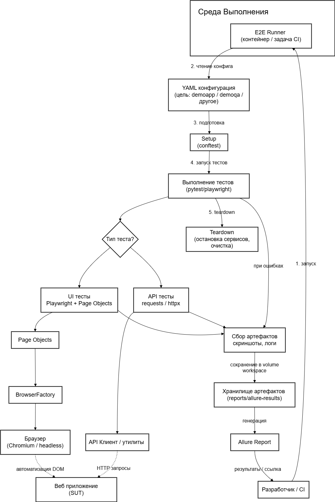

## Фреймворк для сквозного тестирования — Документация проекта

### Введение

Этот проект реализует фреймворк для автоматизированного тестирования веб-приложений.

Основная цель проекта — разработка многократно используемой среды, упрощающей создание, выполнение и анализ сквозных тестов.

Среда тестирования ориентирована на обеспечение воспроизводимой среды тестирования за счет сочетания автоматизированного тестирования браузеров с технологиями контейнеризации.

Система позволяет автоматизировать тестирование пользовательского интерфейса и API, управлять конфигурацией и интегрироваться с современными конвейерами разработки.

Основные задачи среды тестирования:

- автоматизированное тестирование пользовательского интерфейса
- автоматизированное тестирование API
- контейнеризированная среда выполнения
- управление конфигурацией с использованием профилей YAML
- интеграция с CI/CD
- отчетность о тестировании и анализ результатов

Фреймворк реализован с использованием Python и современных инструментов автоматизации тестирования.

---

## Технологический стек

- Python 3.12
- Pytest
- Playwright
- Docker / Docker Compose
- Allure Reports
- GitHub Actions (CI/CD)

Дополнительные библиотеки:

- requests
- pyyaml

---

## Архитектура

Система состоит из трех основных компонентов:

1. **Демонстрационное приложение**
2. **Фреймворк для сквозного тестирования**
3. **Документация и конфигурация CI/CD**

Архитектура фреймворка разработана для обеспечения модульности и расширяемости.

К основным элементам фреймворка относятся:

- слой взаимодействия с браузером
- модуль конфигурации
- слой объектной страницы
- многократно используемые компоненты пользовательского интерфейса
- автоматизированные наборы тестов
- утилиты для создания отчетов и ведения журналов

Структура проекта:

```
demo-app/
e2e-framework/
docs/
docker-compose.yml
```

Диаграмма Архитектуры: 


---

## Демо-приложение

В каталоге `demo-app` находится легковесное веб-приложение, используемое в качестве тестируемой системы.

Оно включает в себя:

- HTML-интерфейс
- простую логику на JavaScript
- минимальный бэкэнд-сервер

Это позволяет проводить стабильные и воспроизводимые тесты пользовательского интерфейса и API.

---

## E2E Framework

Сам фреймворк находится в каталоге `e2e-framework`.

Фреймворк включает в себя несколько функциональных модулей, отвечающих за различные аспекты автоматизированного тестирования.

Основные компоненты:

### Компоненты

Повторно используемые элементы пользовательского интерфейса:

- кнопки
- поля ввода

Эти компоненты помогают упростить взаимодействие с элементами пользовательского интерфейса и уменьшить дублирование кода.

### Ядро

Основные утилиты, такие как инициализация браузера.

Пример:

- BrowserFactory — создает и настраивает экземпляры браузера.

### Локаторы

Содержит селекторы, используемые для тестирования пользовательского интерфейса.

Для разных приложений создаются отдельные файлы локаторов.

### Страницы

Реализует шаблон проектирования **Page Object Model (POM)**.

Каждый класс страницы представляет собой конкретную веб-страницу и инкапсулирует логику взаимодействия с пользовательским интерфейсом.

### Тесты

Наборы тестов разделены на:

- API-тесты
- Тесты пользовательского интерфейса

Каждая группа тестов нацелена на конкретное приложение или среду тестирования.

---

### Система конфигурации

Фреймворк поддерживает конфигурацию с помощью **YAML-файлов и переменных среды**, что позволяет гибко переключаться между различными средами тестирования.

Примеры конфигураций:

- demoapp.local.yaml
- demoapp.docker.yaml
- demoqa.local.yaml

Конфигурация позволяет легко переключаться между средами.

### Логирование и артефакты тестирования

Во время выполнения тестов фреймворк может собирать полезные артефакты, такие как:

- журналы выполнения
- скриншоты при сбое
- отчеты о тестировании

Эти артефакты помогают анализировать неудачные тесты и улучшают отладку.

---

## Выполнение тестов

Тесты выполняются с помощью Pytest.

Примеры:

```
pytest -k api -s -m app_demoapp --config=demoapp.local.yaml
pytest -m app_demoapp --config=demoapp.local.yaml
```

---

## Интеграция с Docker

Тестовая среда может быть запущена внутри контейнеров Docker.

Такой подход гарантирует, что тесты будут выполняться в согласованной и воспроизводимой среде независимо от локальной конфигурации разработчика.

Примеры команд: 

```
docker compose build
docker compose up -d demo-app
docker compose up e2e-demoapp
docker compose up e2e-demoqa
```

Контейнеризация позволяет легко интегрировать фреймворк в конвейеры CI/CD.

---

## Отчеты о тестировании

Allure используется для генерации интерактивных отчетов.

```
allure serve reports/allure-results
```

Отчеты включают:

- результаты тестов
- временную шкалу выполнения
- логи
- вложения

---

## Непрерывная интеграция

Конвейер GitHub Actions автоматически:

1. создает контейнеры
2. запускает тесты
3. сохраняет артефакты

---

## Будущие улучшения

Возможные будущие расширения:

- параллельное выполнение тестов
- интеграция с системами управления тестированием
- автоматическое создание дефектов
- поддержка тестирования производительности
- более тесную связь с системами CI/CD и облачными средами
- использование искусственного интеллекта для анализа результатов тестов
- повышение уровня автономности тестовых систем

---